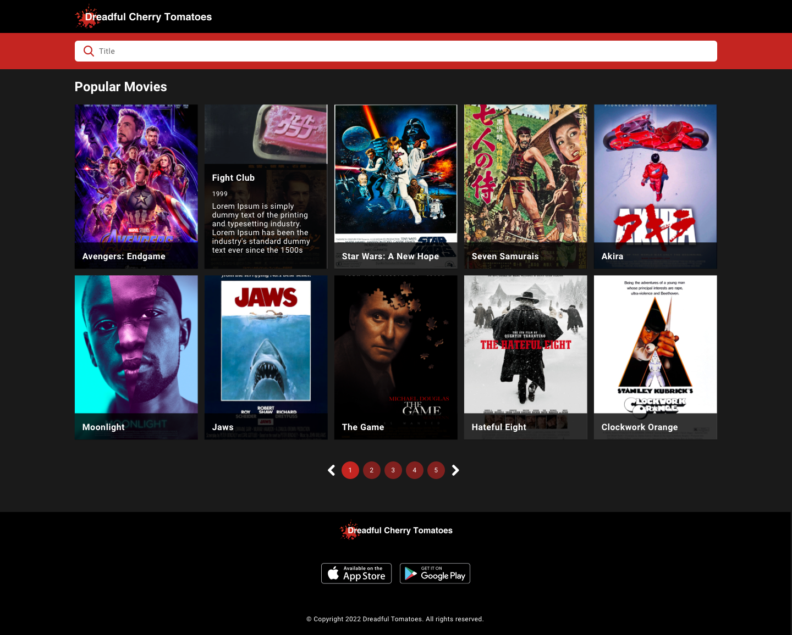

# Dreadful Cherry Tomatoes

Dreadful Cherry Tomatoes is a new platform to find movies. The main objective is to
help users to find information about their favourite movies.

To do so, the company has to create a new web app that allow users to do some fancy things.

## What do you have to do?

Dreadful Cherry Tomatoes needs to implement an awesome webpage where the users could view information
about almost every new movie.

The Design team has sent us the new interface which has to be implemented. To keep it simple, there is only one page: the movies page.

The movies page is the landing page of the webpage and shows a list of movies. In this page the user will see a list of cards with the title, year, description and image from each movie, sorted by the most recent. 10 cards per page, sorted by most recent release year. And the user could filter movies by title.

Here you could see the design of the movies pages:

#### Considerations

* Through [this Figma link (account required)](https://www.figma.com/file/OaRd9F0R43FQWTZQo6JO2Y/GW-867-Dreadful-Cherry-Tomatoes-challenge) or through [this ZIP](https://static.rviewer.io/challenges/assets/dreadful-cherry-tomatoes/assets.zip), you can download all the
assets to start!
* To obtain the data of the Movies, you have to request [this file](https://static.rviewer.io/challenges/datasets/dreadful-cherry-tomatoes/data.json)
* Use SCSS or SASS to manage your stylesheets
* Pay attention to hover effects (Movies cards)

## Technical Requirements

* Create reusable components
* Create a **clean, maintainable and well-designed** code
* Test your code until you are comfortable with that

To understand how you take decisions during the implementation, **please write a COMMENTS.md** file explaining some of
the most important parts of the application. You would also be able to defend your code through
[Rviewer](https://rviewer.io), once you submit your solution.

---

## How to submit your solution

* Push your code to the `devel` branch - we encourage you to commit regularly to show your thinking process was.
* **Create a new Pull Request** to `main` branch & **merge it**.

Once merged you **won't be able to change or add** anything to your solution, so double-check that everything is as
you expected!

Remember that **there is no countdown**, so take your time and implement a solution that you are proud!

---

  If you have any feedback or problem, <a href="mailto:help@rviewer.io">let us know!</a> 🤘
    
  Made with ❤️ by <a href="https://rviewer.io">Rviewer</a>

